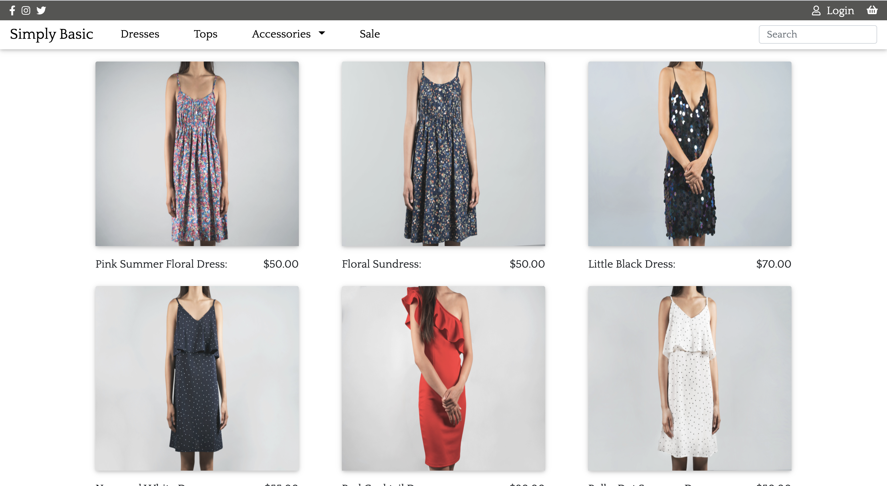
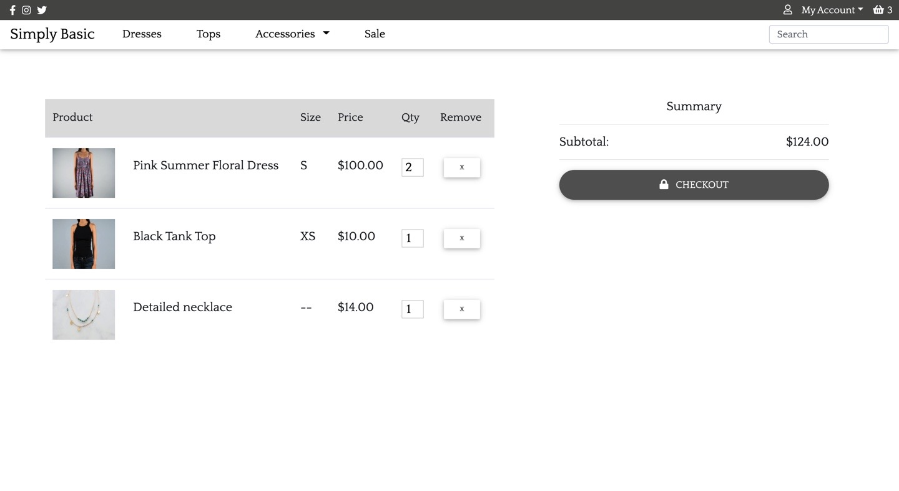

# Simply Basic Clothing Store
This project is a mock up of a clothing store. It has a navigation bar with a drop down menu for items in the store and a search bar. It also has a login option and a shopping cart above the navigation bar. The welcome page features popular items and a user can click on a category in the navbar to be redirected to that page. When a user clicks on an item, they are redirected to a page that displays full item details and an option to add it to their cart. The shopping cart displays all the added items and provides the option to checkout. When a user logs in, they can see their previous orders and the items they saved in their cart. This project is made with a React frontend and a Django backend with PostgreSQL.

## Deployment
-Deployment of frontend to netlify: https://clothingstore-simplybasic.netlify.app/

-Deployment of backend to heroku: https://alyssariah-clothing-store.herokuapp.com/

## Motivation
This site is to be used as a template or an example to show clients what I can do. This projects is obviously not a real clothing store but a mock up to show clients the design and functionality of the site. 

## Code Style
-Backend: Python 

-Frontend: JSX

## Screenshot




## Tech/framework used
-React

-MDBootstrap

-Python

-Django

-PostgreSQL


## Features
Search bar:  A user can type a word into the search field and the backend will search through the titles and categories to find a matching word. The frontend will display those products that have the matching term.

Add to cart: When a user adds an item to their cart, a popup shows that they have added an item to their cart. They have an option to view their cart or the popup will timeout in 3 seconds.

Shopping cart: A user can edit the quantity of the products in their shopping cart, which also automatically updates the price. A user can also delete an item from the cart and a number near the cart icon keeps track of how many items are in the cart.

## Code Example 
Javascript for adding item to cart on the frontend
```
const addToCart = async() => {
        if(!props.user){
            setAlert(true)
        }
        else {
            await makeCartItem(input, props.user.token)
            props.updateCart()
            setViewCart(true)
            setTimeout(() => setViewCart(false), 3000)
        }
    }
```
API call for search bar
```
export const searchData = async(term) => {
    try{const resp = await api.get('/api/search/',{
        params: {
            q: term
        }
    })
    return resp
    }
    catch (err){
        console.log(err)
        return err
    }
}

```

Python models on the backend

```
class Product(models.Model):
    name = models.CharField(max_length=100)
    pictureUrl = models.CharField(max_length=255)
    price = models.IntegerField()
    description = models.TextField(blank=True)
    category = models.CharField(max_length=100, choices=[('Dresses', 'Dresses'), ('Tops', 'Tops'), ('Bottoms', 'Bottoms'), ('Necklaces', 'Necklaces'), ('Bracelets', 'Bracelets'), ('Earrings', 'Earrings'), ('Sale', 'Sale'),])

class CartItem(models.Model):
    owner = models.ForeignKey(User, on_delete=models.CASCADE)
    product = models.ForeignKey(Product, on_delete=models.CASCADE, default=1)
    qty = models.IntegerField(default=1)
    size = models.CharField(max_length=100, choices=[('XS', 'XS'), ('S', 'S'), ('M', 'M'), ('L', 'L'), ('XL', 'XL'), ])
    ordered = models.BooleanField(default=False)

class Order(models.Model):
    owner = models.ForeignKey(User, on_delete=models.CASCADE)
    items = models.ManyToManyField(CartItem)
    created_at = models.DateTimeField(auto_now_add=True)
    total = models.IntegerField(default=0)
```

## How to use?
Login or create your own account on the site. You can then checkout the links under your account tab(profile and orders).
Treat the website like a normal clothing store website: shop around, view different types of clothing, pick your sizes and quantities, and add to your cart. 

## Contribute 
Here are some following guidelines to contribute to Simply Basic. Fork and clone this repository and run npm install. 

### Write detailed information
Detailed information is very helpful to understand an issue.

For example:
* How to reproduce the issue, step-by-step.
* The expected behavior (or what is wrong).
* Screenshots for issues.
* The application version.
* The operating system.


### Pull Requests
Pull Requests are always welcome. 

1. When you edit the code, please run `npm run test` to check the formatting of your code before you `git commit`.
2. Ensure the PR description clearly describes the problem and solution.


## License

Simply Basic © Alyssa Jackson

